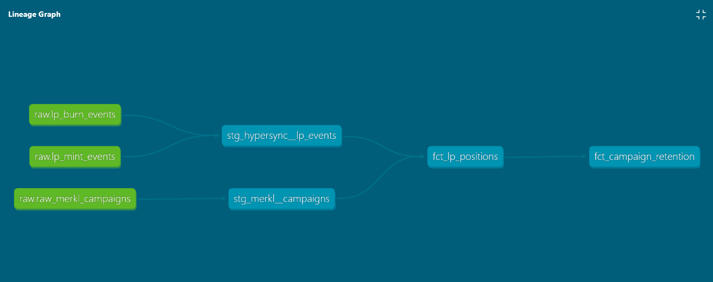

# Financial Data Platform

> **The question**: did this Merkl incentive campaign actually change LP retention — or did it attract mercenary liquidity that left when rewards ended?

- **Ingestion design**: two live APIs, incremental watermark-based fetch, raw layer preserved as-is
- **dbt modelling**: staging/mart separation, signed `liquidity_delta`, `generate_schema_name` macro, full column tests
- **Analytics**: KM survival curves segmented by campaign cohort, logrank p=0.0186
- **Orchestration**: Airflow DAGs are wiring only — logic stays in `ingestion/sources/`

The problem structure is domain-agnostic: replace "Merkl campaign" with any product incentive and the pipeline applies directly.

**Stack**: Python · dbt · PostgreSQL · Dash · Docker · Apache Airflow

---

## Architecture



*Raw sources → typed staging views → mart tables. Two sources, one analytical question.*

| Layer | Tool | Role |
|-------|------|------|
| Ingestion | Python | HyperSync on-chain events + Merkl REST API |
| Warehouse | PostgreSQL | Schemas: `raw` → `staging` → `marts` |
| Transformation | dbt core | Staging models, mart models, tests, lineage |
| Analysis | Python (`lifelines`) | Kaplan-Meier + logrank test |
| Dashboard | Dash + Plotly | 3-tab interactive app on `localhost:8050` |
| Orchestration | Apache Airflow | Daily DAGs for multi-pool scheduling |

---

## Quick Start

**Prerequisites**: Python 3.12+, Docker Desktop, [HyperSync bearer token](https://docs.envio.dev/docs/HyperSync/overview)

```bash
git clone https://github.com/hamzaelmanar/financial-data-platform
cd financial-data-platform

make setup                # create venv, install deps, dbt deps
cp .env.example .env      # fill in Postgres + HyperSync credentials
make ingest               # fetch on-chain events + Merkl campaigns
make run                  # run dbt models
make dashboard            # open http://localhost:8050
```

**Windows** — `make` is not available natively. Use PowerShell instead:

```powershell
# 1. Setup (one-time)
python -m venv .venv
.venv\Scripts\pip install --upgrade pip
.venv\Scripts\pip install -r requirements.txt
Copy-Item .env.example .env        # then edit .env with your credentials
cd dbt ; ..\\.venv\Scripts\dbt deps --profiles-dir . ; cd ..

# 2. Every new terminal — activate venv + load .env
. .\dev.ps1

# 3. Ingest (uses POOL_CHAIN, POOL_ADDRESS, MERKL_URL from .env)
python -m ingestion.sources.hypersync_events --chain $env:POOL_CHAIN --address $env:POOL_ADDRESS
python -m ingestion.utils.decode_events --chain $env:POOL_CHAIN --address $env:POOL_ADDRESS
python -m ingestion.sources.merkl_campaigns --url $env:MERKL_URL

# 4. Run dbt models
cd dbt ; dbt run --profiles-dir . ; cd ..

# 5. Dashboard → http://localhost:8050
python dashboard/app.py
```

> **PostgreSQL must be installed locally** (not Docker). Containers connect to it via `host.docker.internal`.
> Airflow is optional. `make ingest && make run && make dashboard` is the full pipeline.
> To start the Airflow stack: `docker compose --profile airflow up -d` (UI at `localhost:8080`).

Full prerequisites, environment variables, and design decisions: [docs/ARCHITECTURE.md](docs/ARCHITECTURE.md)

---

## Data Model

```
raw_hypersync_lp_events     raw_merkl_campaigns
        |                           |
stg_hypersync__lp_events    stg_merkl__campaigns
        |                           |
        +-----------+---------------+
              fct_lp_positions          <- one row per LP: entry, exit, duration, cohort
                   |
          fct_campaign_retention        <- retention KPIs per cohort
```

| Model | Key columns |
|-------|-------------|
| `fct_lp_positions` | `position_key`, `owner`, `first_mint_timestamp`, `exit_timestamp`, `duration_days`, `is_exited`, `entered_during_campaign` |
| `fct_campaign_retention` | `n_lps_entered`, `retention_rate_7d`, `retention_rate_30d`, `median_hold_days` |

SQL prepares the data. Python (`lifelines`) runs the statistics.

---

## Origin

Refactored from [`uniswap-lp-analysis`](https://github.com/hamzaelmanar/uniswap-lp-analysis) — a working LP retention analysis in notebook-style Python. This project restructures it into a tested, orchestrated pipeline with a clean data model.